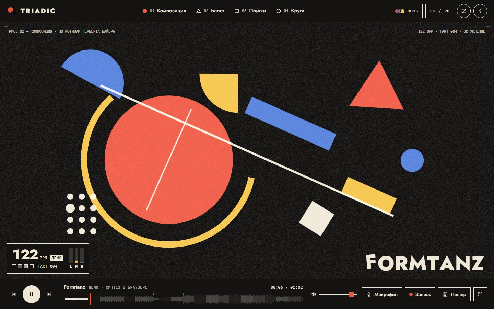
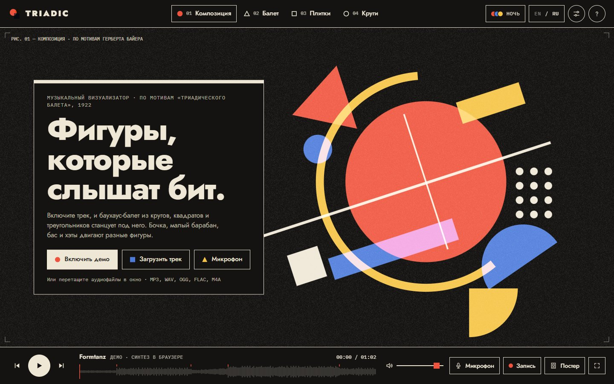
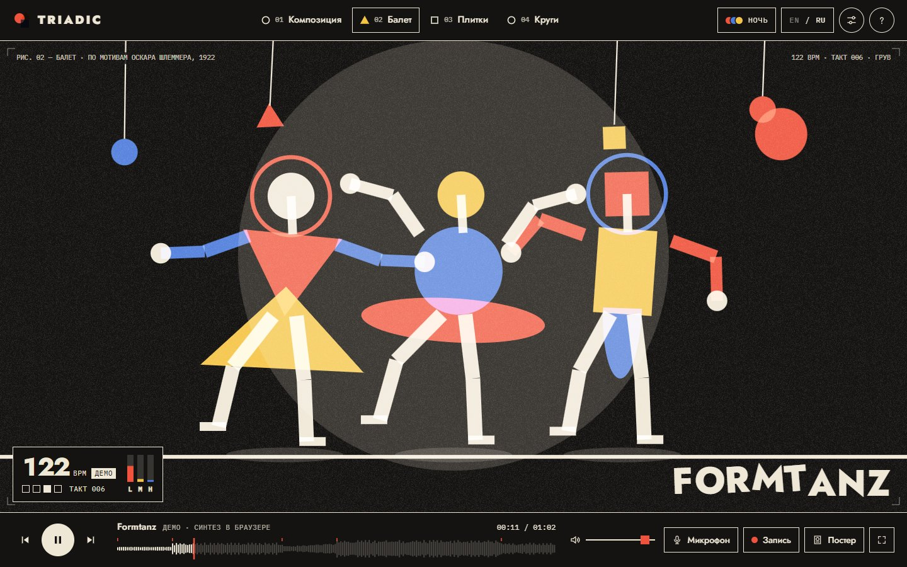
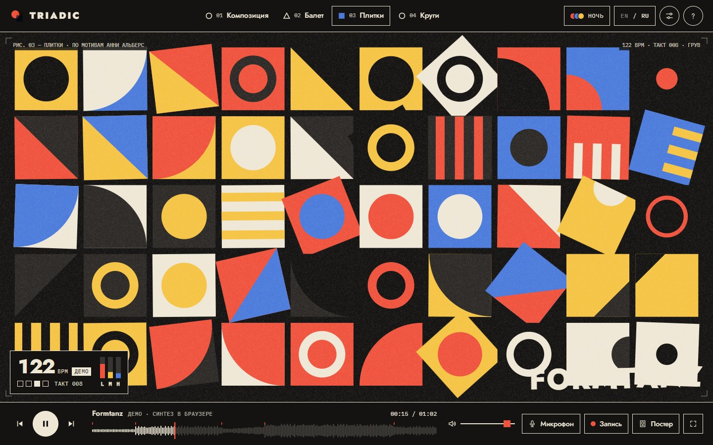
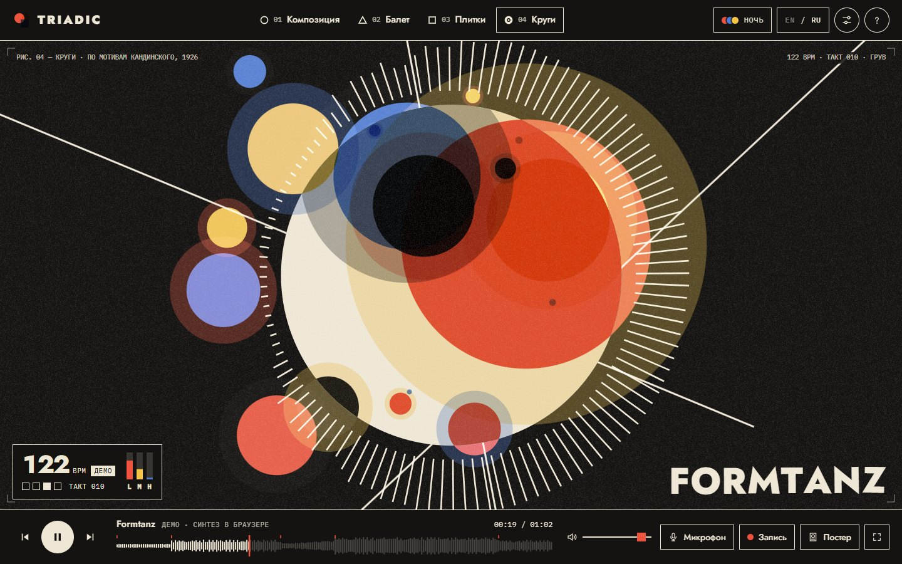
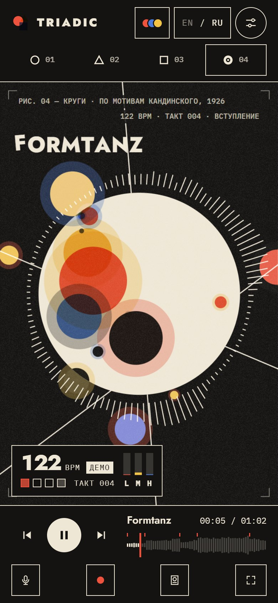
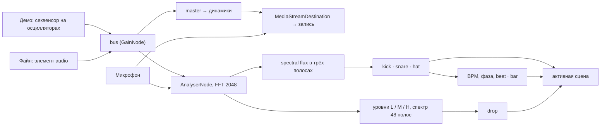

<p align="center">
  
</p>

# Triadic — музыкальный визуализатор в духе Баухауза

> Фигуры, которые слышат бит. Круги, квадраты и треугольники танцуют под музыку: бочка, малый барабан, бас и хай-хэты двигают разные фигуры. Отсылка к «Триадическому балету» Оскара Шлеммера (1922).


**Главное:**
- **У каждого удара своя фигура.** Onset-детекция по spectral flux отдельно в трёх полосах — бочка (35–150 Гц), малый барабан (1,5–5 кГц) и хэты (7–14 кГц) — с адаптивным порогом. Темп оценивается по гистограмме интервалов между ударами бочки, фаза бита подтягивается к бочке, дропы ловятся по скачку энергии.
- **Демо-трек написан кодом.** «Formtanz» — 122 BPM, ля минор, 32 такта — играют 11 синтезированных инструментов и эффектов на осцилляторах и шуме, секвенсор планирует ноты с упреждением из Web Worker, а визуальный дроп совпадает со звуковым с учётом задержки вывода.
- **Ноль библиотек, один файл.** Canvas 2D и Web Audio, четыре сцены по мотивам художников Баухауза, экспорт постера PNG 1600 × 2000 и видео со звуком.

## Идея

В «Триадическом балете» Оскар Шлеммер одел танцоров в костюмы из кругов, конусов и дисков и превратил движение в геометрию. Triadic делает то же с музыкой: вместо привычных столбиков спектра ритм становится хореографией. Бочка раздувает красный круг, малый барабан поворачивает треугольник и закручивает юбки танцоров, хэты зажигают точки растра, бас и средние частоты растягивают полосы. Разные инструменты видно по разным фигурам, поэтому структуру трека можно буквально разглядеть.

Визуальный язык — печатный лист: метки обреза по углам, подпись «Рис. 01 — Композиция · по мотивам Герберта Байера», как в каталоге выставки, бумажное зерно и наложение красок в режиме `multiply`, как при трафаретной печати или ризографии. Поверх — кинетический заголовок, буквы которого подпрыгивают на долю одна за другой.

Проект для музыкантов, диджеев и VJ, которым нужен живой визуал без установки программ, и для дизайнеров, которым интересен Баухауз в движении. Как портфолио он показывает обработку звука в реальном времени прямо в браузере, генеративную графику и внимание к деталям интерфейса: безопасный режим без вспышек, горячие клавиши в любой раскладке, экспорт.

## Скриншоты

<table>
  <tr>
    <td width="50%" valign="top"><br><sub>Стартовый экран</sub></td>
    <td width="50%" valign="top"><br><sub>Сцена «Балет» — по Шлеммеру</sub></td>
  </tr>
  <tr>
    <td width="50%" valign="top"><br><sub>Сцена «Плитки» — по Анни Альберс</sub></td>
    <td width="50%" valign="top"><br><sub>Сцена «Круги» — по Кандинскому</sub></td>
  </tr>
</table>

<p align="center">
  
  <br><sub>Мобильная версия</sub>
</p>

## Возможности

### Источники звука
- **Демо «Formtanz»** синтезируется в браузере в момент воспроизведения и играет по кругу; аудиофайлов в проекте нет. На таймлайне отмечены разделы: вступление, грув, брейк, дроп, финал.
- **Свои треки.** Перетаскивание файлов в любое место окна, кнопка «Загрузить трек» и очередь в настройках с длительностями и удалением. Подходит всё, что умеет декодировать браузер: MP3, WAV, OGG, FLAC, M4A, AAC, Opus, WebM.
- **Таймлайн-волна.** Для файлов пики считаются через `decodeAudioData` (720 точек), перемотка — кликом или перетаскиванием по волне.
- **Микрофон.** Живой вход без эхоподавления, шумоподавления и автоусиления, чтобы детектор видел настоящие атаки. Сигнал идёт в анализатор и в запись, но не в динамики — обратной связи нет.
- **Media Session API:** название трека и сцены в системном плеере, управление с клавиатуры и гарнитуры (play, pause, следующий, предыдущий, перемотка).

### Сцены

| № | Сцена | По мотивам | Как реагирует на музыку |
|---|---|---|---|
| 01 | Композиция | Герберт Байер | Живой плакат из 12 элементов: бочка раздувает красный круг, малый поворачивает треугольник на 120°, хэты зажигают точки растра, полосы тянутся за уровнями низких, средних и высоких частот, жёлтое кольцо вращается быстрее на средних. Каждые 8 тактов — новая раскладка из четырёх, в портретной ориентации плакат поворачивается на 90° |
| 02 | Балет | Оскар Шлеммер, 1922 | Три танцора в костюмах из треугольника, диска и прямоугольника приседают на каждую долю, малый барабан по очереди закручивает их юбки, хэты наклоняют головы и нимбы, на дропе все подпрыгивают, а центральный делает полный оборот. Над сценой качается мобиль, красное солнце пульсирует на бочку, каждые 8 тактов танцоры перестраиваются |
| 03 | Плитки | Анни Альберс | Сетка плиток с шестью мотивами (четверть круга, полукруг, треугольник, круг, кольцо, полосы). На каждую долю по сетке проходит волна поворотов на 90° по одному из четырёх рисунков, малый меняет местами фон и фигуру, размер мотивов следует за спектром под колонкой, курсор поворачивает плитку под собой |
| 04 | Круги | Василий Кандинский, «Несколько кругов», 1926 | 15 кругов, плывущих по орбитам внутри и вокруг тёмного диска; размер каждого привязан к своей полосе спектра. Внутри диска режим наложения инвертируется и круги светятся, снаружи печатаются как краска; вокруг — зеркальный радиальный спектр из 120 штрихов и три линии, хэты рассыпают искры |

### Общее для всех сцен
- «Удар камеры» на бочку, ударная волна на дропе, переход между сценами раскрывающимся кругом с красной кромкой.
- Фигуры отталкиваются от курсора, клик бросает 18 новых фигур, которые разлетаются и падают под действием гравитации.
- Кинетический заголовок с названием трека, подпись-колофон с номером рисунка, BPM, номером такта и разделом демо-трека.
- Когда ничего не играет, сцена «дышит» медленной синусоидой, чтобы экран не был мёртвым.

### HUD и хореография
- **HUD:** BPM и его источник (`DEMO`, `AUTO`, `TAP`, `LIVE`), четыре квадрата долей с красной первой, номер такта, индикаторы уровней L / M / H, во время записи — метка `REC` с таймером.
- **Авто-хореография:** сцена сама меняется на дропах и каждые 32 такта, раскладка внутри сцены обновляется каждые 8 тактов.
- **Тап-темп:** три и более нажатия `T` в такт задают BPM вручную на 30 секунд (для своих треков и микрофона; у демо темп известен точно).
- **Настройки:** чувствительность детектора 0,4–2,2×, интенсивность движения 0–160 %, четыре палитры, бумажное зерно, безопасный режим, язык. Всё сохраняется в `localStorage`.
- **Ссылка на образ:** адрес вида `#ballet.riso` открывает ту же сцену и палитру; ссылка из адресной строки важнее сохранённых настроек.
- Zen-режим прячет интерфейс, на весь экран остаётся только сцена; курсор исчезает через 2,6 с без движения во время воспроизведения.

### Экспорт
- **Постер** PNG 1600 × 2000: сцена на 74 % высоты, ниже — название трека крупным кеглем, BPM, номер и название сцены, автор-источник, дата и логотип. Постер рисуется той же функцией `renderFrame`, но без тряски камеры, частиц и заголовка.
- **Видео** со звуком через MediaRecorder: WebM (VP9 или VP8 с Opus) или MP4 (H.264 с AAC), в зависимости от того, что поддерживает браузер.
- Файлы называются по сцене и времени: `triadic-ballet-20260926-213045.png`.

## Как это устроено



### Полосы и onset-детекция
`AnalyserNode` работает с окном 2048 отсчётов и диапазоном −90…−18 дБ. Каждый кадр `An.update()` считает три сглаженных уровня — низ 35–160 Гц, середина 400–2500 Гц, верх 4–12 кГц — с быстрой атакой и медленным спадом, а также 48 логарифмических полос от 40 Гц до 14 кГц для сцен. Удары ищутся по spectral flux: сумме положительных приростов амплитуды между соседними кадрами в полосе бочки, малого и хэтов. Порог адаптивный — среднее плюс 1,4 стандартного отклонения за последние 45 кадров, с защитным интервалом 200, 140 и 70 мс соответственно:

```js
detect(k, v, now, gap, minAbs) {
  const h = this.hist[k]; h.push(v); if (h.length > 45) h.shift();
  if (h.length < 10) return false;
  let m = 0; for (const x of h) m += x; m /= h.length;
  let sd = 0; for (const x of h) sd += (x - m) * (x - m); sd = Math.sqrt(sd / h.length);
  if (v > m + (1.4 * sd) / Math.sqrt(S.sens) + minAbs && now - this.lastOn[k] > gap) { this.lastOn[k] = now; return true; }
  return false;
},
```

Ползунок чувствительности одновременно усиливает уровни и снижает порог детектора.

### Темп: оценка BPM и тап
`An.estimate()` раз в полсекунды берёт удары бочки за последние 10 секунд и строит гистограмму темпа от 70 до 170 BPM по всем парам ударов в пределах 2,2 с, а не только по соседним. Темп вне диапазона удваивается или делится пополам (октавная свёртка), пары соседних ударов весят больше, каждое попадание размазывается гауссом на ±2 BPM, а вершина уточняется параболической интерполяцией. Оценка в пределах 2,5 BPM от текущей плавно подмешивается, а скачок принимается только после двух подтверждений подряд. Фаза бита идёт непрерывно и на каждой бочке сдвигается на 40 % ошибки, если та меньше 0,3 доли. У демо-трека темп и фаза известны точно: они считаются от часов `AudioContext` с поправкой на `outputLatency`.

### Детекция дропа и хореография
Энергия трека (60 % низов, 30 % середины, 10 % верха) сглаживается двумя скользящими средними — быстрой и медленной. Дроп засчитывается, когда быстрая энергия выше 0,55, в 1,4 раза выше медленной, низы громче 0,55 и с прошлого дропа прошло больше 14 секунд: громкая басовая часть сразу после тихой. В демо дроп присылает сам секвенсор на 17-м такте. Анализатор рассылает события `kick`, `snare`, `hat`, `beat`, `bar` и `drop`; менеджер сцен передаёт их активной сцене, каждые 8 тактов вызывает смену раскладки, а при включённой авто-хореографии переключает сцену на дропе и раз в 32 такта.

### Демо-трек, написанный кодом
Модуль `Demo` — шестнадцатишаговый секвенсор на 32 такта с аккордами Am — F — C — G. Бочка — синус со спадом высоты от 165 до 40 Гц и щелчок шума, клэп — три коротких всплеска полосового шума, хэты — шум через фильтр высоких частот 7,8 кГц, бас — пила и квадрат октавой ниже через резонансный фильтр, стэбы и пэд — расстроенные пилы и треугольники, лид — квадрат через задержку на 3/16 с обратной связью. Брейк нагнетается райзером и дробью малого, дроп начинается с крэша и низкого «бума». Ноты планируются с упреждением 120 мс по часам `AudioContext`, а тикает планировщик в Web Worker, созданном из Blob, поэтому ритм не сбивается в фоновой вкладке. Каждый запуск получает свою шину голосов, и пауза или перемотка глушат длинные ноты за 40 мс. Волна на таймлайне для демо рассчитывается из структуры трека, без декодирования.

### Рендеринг: пружины, лист и палитры
Все позиции, повороты и масштабы — пружины (`class Spring` с жёсткостью и затуханием), поэтому фигуры доезжают до новых раскладок с естественным перелётом. Координаты задаются в долях листа, и одно и то же состояние рисуется на экране любого размера и на постере. Палитры сменяются плавным переходом цветов за 0,6 с, светлые используют наложение `multiply`, ночная — `screen`. Canvas создаётся без альфа-канала, плотность пикселей ограничена 2 (1,75 на сенсорных экранах), зерно — заранее отрисованная плитка-паттерн.

### Экспорт: постер и видео
Постер рендерится во внеэкранный canvas 1600 × 2000 и сохраняется как PNG. Видео записывается из `canvas.captureStream(60)`, к которому добавляется звуковая дорожка из `MediaStreamDestination`, — в ролик попадает то, что играет, включая микрофон. Формат выбирается первым поддерживаемым из списка WebM VP9, WebM VP8, WebM, MP4 H.264, MP4, битрейт видео — 8 Мбит/с. Внутри артефакта claude.ai файлы сохраняются через возможность `downloads`, в обычном браузере — через ссылку с атрибутом `download`.

## Дизайн

| Палитра | Бумага | Чернила | Красный | Синий | Жёлтый | Наложение |
|---|---|---|---|---|---|---|
| Classic | `#EFE7D6` | `#141312` | `#E2412E` | `#1F4DA1` | `#F4B324` | multiply |
| Night | `#141312` | `#EFE7D6` | `#F0533D` | `#4C7BDB` | `#F5C445` | screen |
| Riso | `#F4EEE3` | `#1C2B4B` | `#FF4E88` | `#0096A6` | `#FFCF3A` | multiply |
| Mono | `#E8E5DE` | `#121212` | `#121212` | `#77736B` | `#BDB7AB` | multiply |

- **Цвета** — баухаусная триада: красный, синий и жёлтый плюс чернила и бумага. Интерфейс перекрашивается вместе со сценой через CSS-переменные, при системной тёмной теме по умолчанию включается Night.
- **Типографика.** Jost — геометрический гротеск в духе Futura: логотип 900, заголовки и кинетический заголовок 800, интерфейс 500. IBM Plex Mono — подписи, HUD, клавиши и таймкоды.
- **Сетка.** Сцена занимает весь экран; сверху — шапка с переключателем сцен, снизу — док с транспортом, волной и инструментами, справа выезжает панель настроек. Рамки в 1,5 px, прямые углы, круглые только кнопки воспроизведения и иконки; у карточки-приглашения и модальных окон верхняя рамка 8 px.
- **Движение.** Пружинная физика сцен, переход «ирисом» за 0,95 с, одна кривая `cubic-bezier(.7, 0, .2, 1)` для интерфейса.
- **Безопасный режим.** Без жёлтой вспышки на дропе, без дрожания камеры, толчок на бочку ослаблен до четверти, заголовок подпрыгивает ниже, ударная волна медленнее. Режим включён по умолчанию, если в системе задано `prefers-reduced-motion`, — тогда же отключаются CSS-анимации интерфейса.
- **Доступность.** Canvas описан через `role="img"` и `aria-label`, таймлайн — `slider` с текущим значением, сцены и кнопки-переключатели отдают `aria-pressed`, тумблеры в настройках — настоящие чекбоксы, у справки — `aria-modal` и возврат фокуса, фокус виден красной обводкой, на сенсорных экранах зоны касания не меньше 44 px.
- **Два языка.** Интерфейс, подписи на холсте и постер переводятся на русский и английский, язык определяется по браузеру.

## Управление

| Клавиша | Действие |
|---|---|
| `Space` | Играть или пауза |
| `1`–`4` | Сменить сцену |
| `←` / `→` | Перемотка на 5 секунд |
| `↑` / `↓` | Громкость ±5 % |
| `B` / `N` | Предыдущий / следующий трек |
| `A` | Авто-хореография |
| `P` | Следующая палитра |
| `T` | Тап-темп |
| `M` | Микрофон |
| `R` | Начать или остановить запись видео |
| `S` | Сохранить постер |
| `H` | Скрыть интерфейс |
| `F` | Полный экран |
| `?` | Список клавиш |
| `Esc` | Закрыть справку или настройки, вернуть интерфейс |
| Клик по сцене | Бросить фигуры |

Клавиши привязаны к физическим кнопкам (`KeyboardEvent.code`) и работают в русской раскладке.

## Стек

| Технология | Версия | Для чего |
|---|---|---|
| JavaScript без фреймворков | — | Весь код, около 1 650 строк скрипта |
| Canvas 2D | — | Сцены, частицы, зерно, постер, волна таймлайна |
| Web Audio API | — | Синтез демо (`OscillatorNode`, `BiquadFilterNode`, `DelayNode`, `DynamicsCompressorNode`), анализ (`AnalyserNode`), воспроизведение файлов, шина записи |
| Web Worker | — | Тикер секвенсора, не засыпающий в фоне |
| MediaRecorder, `captureStream` | — | Запись видео со звуком |
| `getUserMedia` | — | Вход с микрофона |
| Media Session API | — | Системный плеер и медиаклавиши |
| Fullscreen, Clipboard, History API | — | Полный экран, ссылка на образ |
| `localStorage` | — | Настройки |
| Google Fonts | — | Jost, IBM Plex Mono |

## Структура кода

Весь проект — `index.html`. Скрипт разделён на пронумерованные секции: утилиты и пружины → тексты RU/EN → палитры и настройки → уведомления и сохранение файлов → демо-трек → аудиодвижок, плеер, микрофон, очередь, Media Session → анализ → ядро рендеринга (фигуры, курсор, частицы, зерно, заголовок, метки) → четыре сцены → менеджер сцен и `renderFrame` → постер и запись → интерфейс → загрузка.

## Запуск

Откройте `index.html` в браузере — установка и сборка не нужны, шрифты подгружаются с Google Fonts. Если браузер не даёт доступ к микрофону со страницы, открытой из файла, запустите локальный сервер:

```bash
python -m http.server 8000
# затем http://localhost:8000
```

Запись видео работает в браузерах с MediaRecorder и `captureStream` — Chrome, Edge, Firefox. Звук запускается после первого нажатия: так требует политика автовоспроизведения браузеров.

---

Концепт-проект. Сцены — оммаж работам Герберта Байера, Оскара Шлеммера, Анни Альберс и Василия Кандинского, а не их копии; демо-трек «Formtanz» написан кодом.
